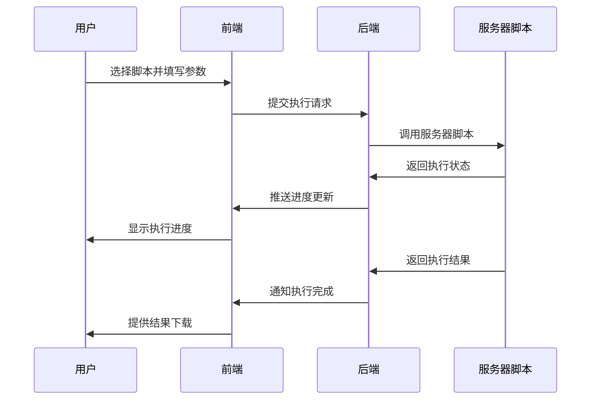
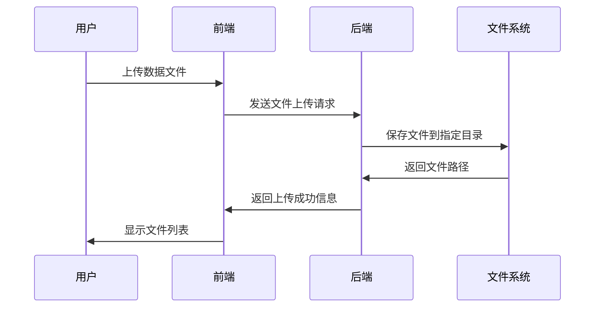

# 数据分析平台

## 项目概述

这是一个为团队提供数据分析服务的Web平台，旨在解决以下问题：
- 团队成员不熟悉服务器操作
- 需要通过技术人员获取数据分析结果
- 缺乏统一的数据分析界面

## 核心功能

### 1. 脚本管理系统
- 上传和管理分析脚本
- 脚本参数配置
- 脚本执行状态监控

### 2. 交互式分析界面
- 用户友好的参数输入表单
- 实时执行进度显示
- 结果预览和下载

### 3. 文件系统管理
- 数据文件上传下载
- 结果文件管理
- 文件权限控制

### 4. 用户权限系统
- 用户认证和授权
- 角色权限管理
- 操作日志记录

## 技术栈

### 前端
- **框架**: React 18 + TypeScript
- **构建工具**: Vite
- **UI组件库**: Material-UI (MUI)
- **状态管理**: React Query + Zustand
- **路由**: React Router
- **HTTP客户端**: Axios

### 后端
- **框架**: NestJS
- **数据库ORM**: Prisma
- **数据库**: PostgreSQL
- **认证**: JWT + Passport
- **文件处理**: Multer
- **API文档**: Swagger

### 部署
- **容器化**: Docker + Docker Compose
- **包管理**: PNPM Workspace
- **版本控制**: Git

## 项目结构

```
data-analysis-platform/
├── frontend/                 # 前端应用
│   ├── src/
│   │   ├── components/      # 通用组件
│   │   ├── pages/          # 页面组件
│   │   ├── hooks/          # 自定义钩子
│   │   ├── services/       # API服务
│   │   ├── stores/         # 状态管理
│   │   ├── types/          # TypeScript类型
│   │   └── utils/          # 工具函数
│   ├── public/             # 静态资源
│   ├── package.json
│   ├── vite.config.ts
│   └── tsconfig.json
├── backend/                 # 后端应用
│   ├── src/
│   │   ├── modules/        # 业务模块
│   │   │   ├── auth/       # 认证模块
│   │   │   ├── scripts/    # 脚本管理
│   │   │   ├── files/      # 文件管理
│   │   │   └── users/      # 用户管理
│   │   ├── common/         # 通用模块
│   │   ├── database/       # 数据库配置
│   │   └── main.ts
│   ├── prisma/             # 数据库schema
│   ├── package.json
│   └── nest-cli.json
├── docker/                  # Docker配置
│   ├── frontend.Dockerfile
│   ├── backend.Dockerfile
│   └── docker-compose.yml
├── scripts/                 # 部署脚本
├── docs/                   # 项目文档
├── package.json            # 根package.json
├── pnpm-workspace.yaml     # PNPM工作区配置
└── .gitignore
```

## 核心业务流程

### 1. 脚本执行流程


### 2. 文件管理流程


## 开发规范

### 代码规范
- 使用ESLint + Prettier进行代码格式化
- 遵循TypeScript严格模式
- 使用Conventional Commits规范

### 分支管理
- `main`: 生产环境分支
- `develop`: 开发分支
- `feature/*`: 功能分支
- `hotfix/*`: 热修复分支

### API设计规范
- RESTful API设计
- 统一的响应格式
- 完整的错误处理
- API版本管理

## 部署说明

### 开发环境
```bash
# 安装依赖
pnpm install

# 启动开发服务器
pnpm dev

# 前端: http://localhost:5173
# 后端: http://localhost:3000
```

### 生产环境
```bash
# 构建Docker镜像
docker-compose build

# 启动服务
docker-compose up -d
```

## 安全考虑

1. **认证授权**: JWT令牌 + 角色权限控制
2. **文件安全**: 文件类型检查 + 路径遍历防护
3. **脚本执行**: 沙箱环境 + 资源限制
4. **数据传输**: HTTPS + 数据加密
5. **日志审计**: 操作日志记录

## 性能优化

1. **前端优化**:
   - 代码分割和懒加载
   - 组件缓存和虚拟化
   - 静态资源压缩

2. **后端优化**:
   - 数据库查询优化
   - 缓存策略
   - 异步任务处理

3. **部署优化**:
   - CDN加速
   - 负载均衡
   - 容器资源限制

## 扩展性设计

1. **微服务架构**: 支持服务拆分
2. **插件系统**: 支持自定义分析插件
3. **多租户**: 支持多团队隔离
4. **云原生**: 支持Kubernetes部署
