# 数据分析平台技术架构

## 系统架构概览

### 整体架构图

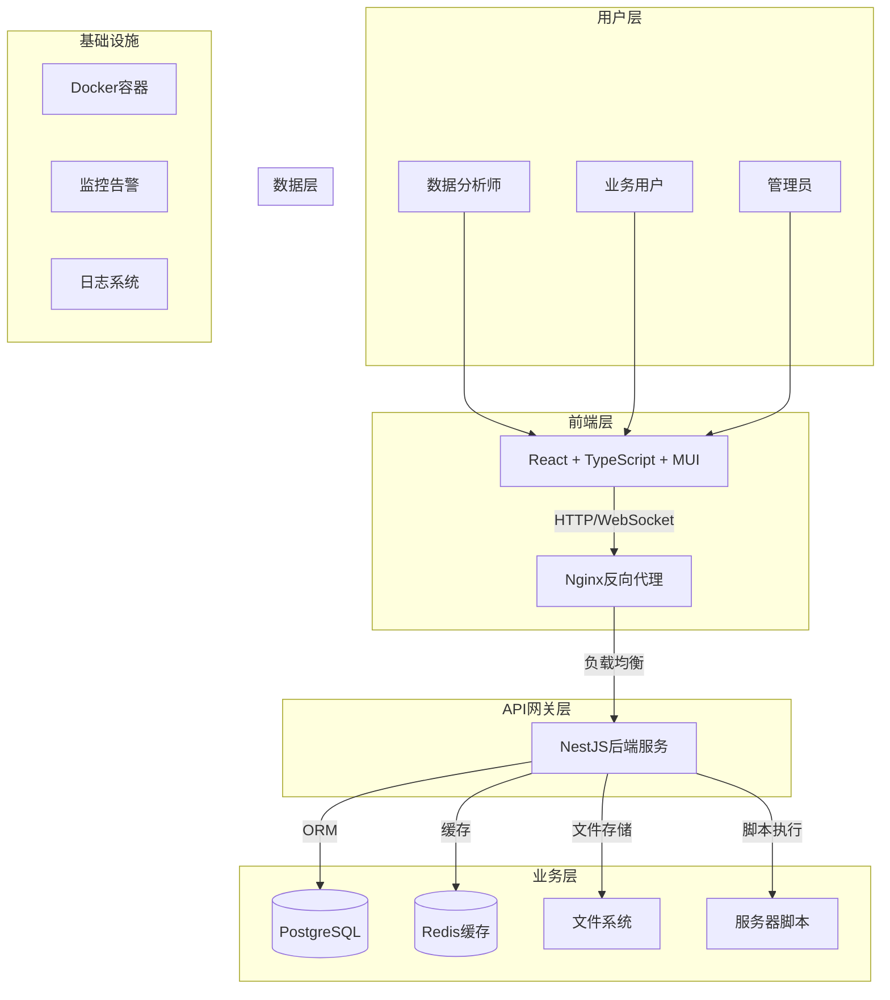

### 技术栈选型

#### 前端技术栈
- **React 18**: 现代化的组件化框架
- **TypeScript**: 类型安全和更好的开发体验
- **Vite**: 快速的构建工具
- **Material-UI**: 企业级UI组件库
- **React Query**: 数据获取和缓存
- **Zustand**: 轻量级状态管理
- **React Router**: 前端路由
- **React Hook Form**: 表单处理

#### 后端技术栈
- **NestJS**: 企业级Node.js框架
- **TypeScript**: 全栈类型安全
- **Prisma**: 现代化ORM
- **PostgreSQL**: 关系型数据库
- **Redis**: 缓存和会话存储
- **JWT**: 认证授权
- **Socket.IO**: 实时通信
- **Multer**: 文件上传处理

#### 部署技术栈
- **Docker**: 容器化部署
- **Docker Compose**: 多容器编排
- **Nginx**: 反向代理和负载均衡
- **PNPM**: 高效的包管理
- **Git**: 版本控制

## 系统模块设计

### 1. 认证授权模块

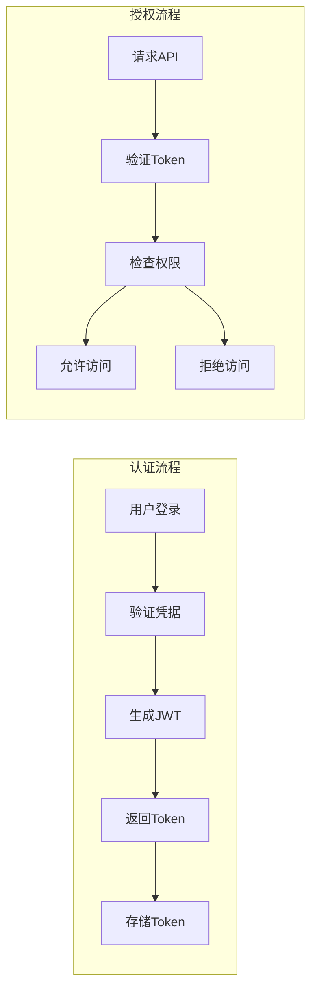

**功能特性:**
- JWT令牌认证
- 角色权限控制（Admin/Analyst/User）
- 会话管理
- 密码加密存储
- 登录状态持久化

### 2. 脚本管理模块

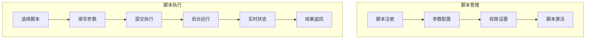

**功能特性:**
- 脚本注册和管理
- 动态参数配置
- 执行状态监控
- 结果文件管理
- 执行历史记录
- 并发执行控制

### 3. 文件管理模块

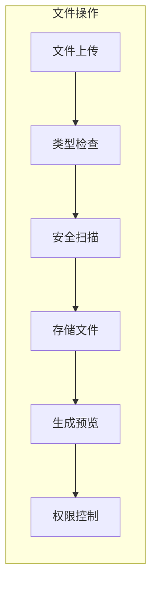

**功能特性:**
- 多种文件格式支持
- 文件预览功能
- 批量上传下载
- 文件权限管理
- 存储空间管理
- 文件版本控制

### 4. 实时通信模块

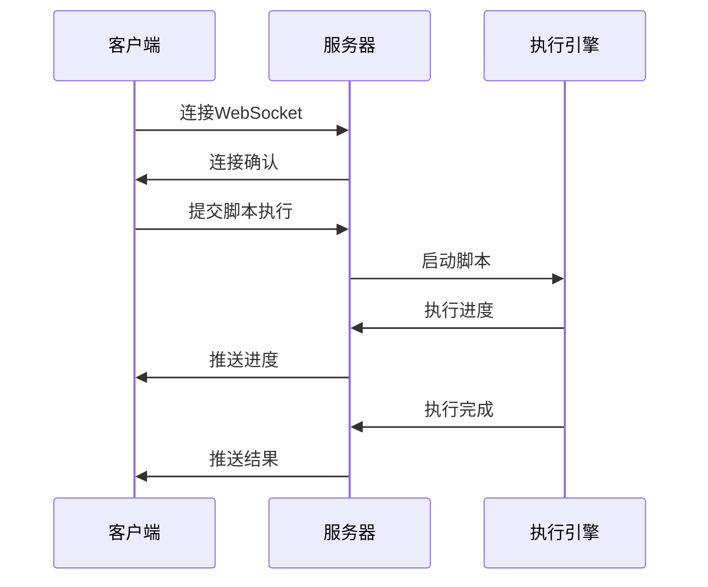

**功能特性:**
- WebSocket实时通信
- 执行进度推送
- 错误信息通知
- 系统状态监控
- 多用户广播

## 数据库设计

### 核心实体关系

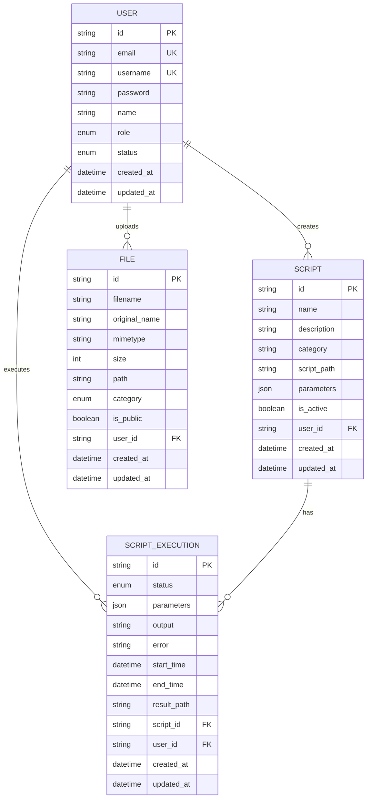

### 数据表设计原则

1. **规范化设计**: 避免数据冗余，保证数据一致性
2. **索引优化**: 为常用查询字段添加索引
3. **类型安全**: 使用枚举类型约束数据
4. **审计追踪**: 记录创建和更新时间
5. **软删除**: 重要数据使用软删除策略

## 安全架构

### 安全防护体系

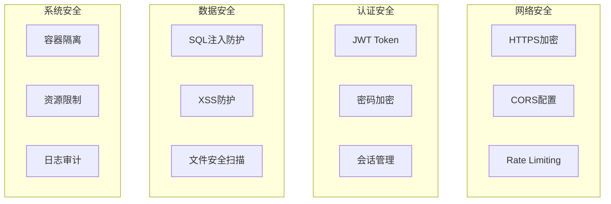

### 安全措施

1. **传输安全**
   - HTTPS强制加密
   - JWT令牌传输
   - CORS跨域控制

2. **认证安全**
   - bcrypt密码加密
   - JWT令牌过期机制
   - 多层权限验证

3. **数据安全**
   - Prisma ORM防SQL注入
   - 输入数据验证
   - 敏感数据加密存储

4. **文件安全**
   - 文件类型检查
   - 路径遍历防护
   - 病毒扫描集成

5. **系统安全**
   - Docker容器隔离
   - 资源使用限制
   - 操作日志记录

## 性能优化

### 前端性能优化

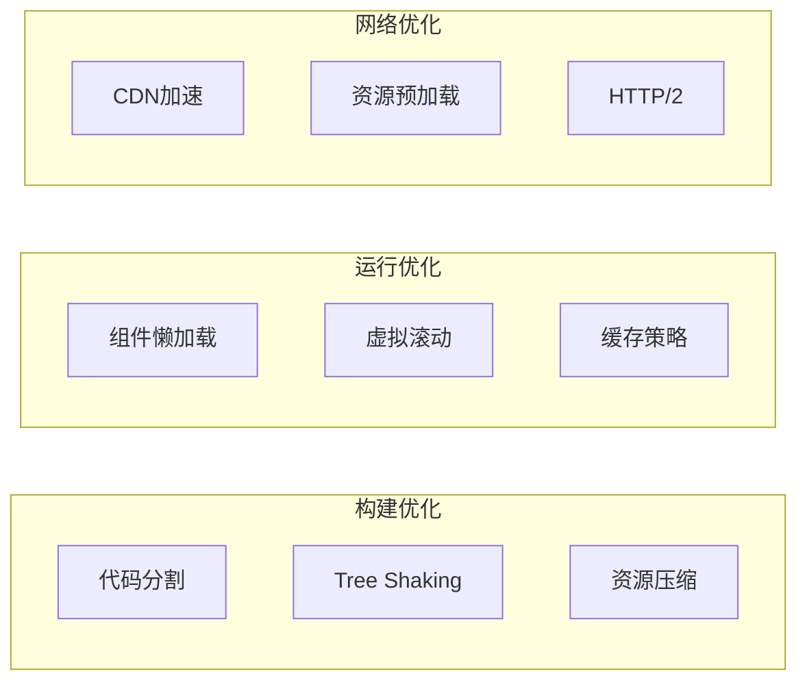

### 后端性能优化

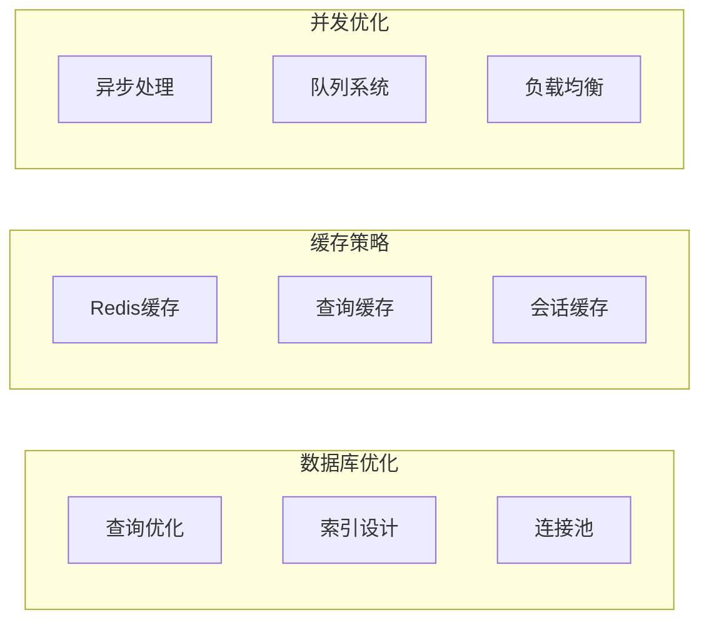

### 性能指标

1. **响应时间**
   - API响应 < 200ms
   - 页面加载 < 3s
   - 脚本执行状态实时更新

2. **并发能力**
   - 支持100+并发用户
   - 同时执行5个脚本任务
   - 文件上传并发处理

3. **资源使用**
   - 内存使用 < 2GB
   - CPU使用率 < 80%
   - 磁盘IO优化

## 部署架构

### 容器化部署

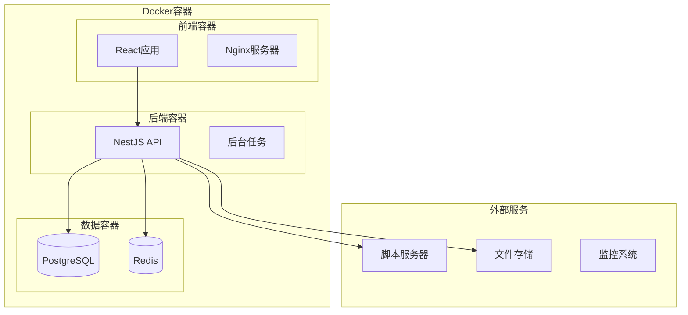

### 部署环境

1. **开发环境**
   - 本地Docker开发
   - 热重载支持
   - 调试工具集成

2. **测试环境**
   - CI/CD自动部署
   - 自动化测试
   - 性能测试

3. **生产环境**
   - 高可用部署
   - 负载均衡
   - 监控告警

### 扩展性设计

1. **水平扩展**
   - 多实例部署
   - 负载均衡
   - 数据库分片

2. **垂直扩展**
   - 资源配置调整
   - 性能优化
   - 缓存策略

3. **功能扩展**
   - 插件系统
   - API扩展
   - 第三方集成

## 监控运维

### 监控体系

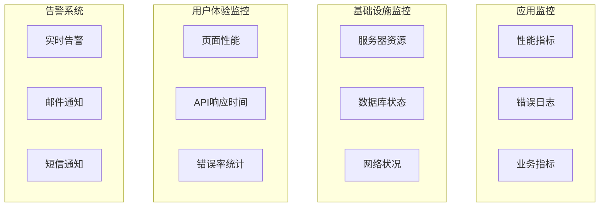

### 日志管理

1. **日志分类**
   - 访问日志
   - 错误日志
   - 业务日志
   - 安全日志

2. **日志格式**
   - 结构化日志
   - 统一时间戳
   - 链路追踪ID

3. **日志存储**
   - 本地文件存储
   - 集中式日志系统
   - 日志轮转策略

### 备份恢复

1. **数据备份**
   - 数据库定时备份
   - 文件系统备份
   - 配置文件备份

2. **灾难恢复**
   - 恢复流程文档
   - 定期恢复演练
   - 多地备份策略

## 开发规范

### 代码规范

1. **TypeScript规范**
   - 严格模式开启
   - 类型定义完整
   - 接口设计规范

2. **代码风格**
   - ESLint + Prettier
   - 统一缩进和换行
   - 命名规范统一

3. **注释规范**
   - JSDoc注释
   - 复杂逻辑说明
   - API文档生成

### Git工作流

```mermaid
gitgraph
    commit id: "Initial"
    branch develop
    checkout develop
    commit id: "Feature 1"
    branch feature/user-auth
    checkout feature/user-auth
    commit id: "Add auth"
    checkout develop
    merge feature/user-auth
    commit id: "Merge auth"
    checkout main
    merge develop
    commit id: "Release v1.0"
```

### 测试策略

1. **单元测试**
   - Jest测试框架
   - 组件测试
   - 工具函数测试

2. **集成测试**
   - API接口测试
   - 数据库集成测试
   - 第三方服务测试

3. **端到端测试**
   - 用户流程测试
   - 关键功能测试
   - 性能测试
